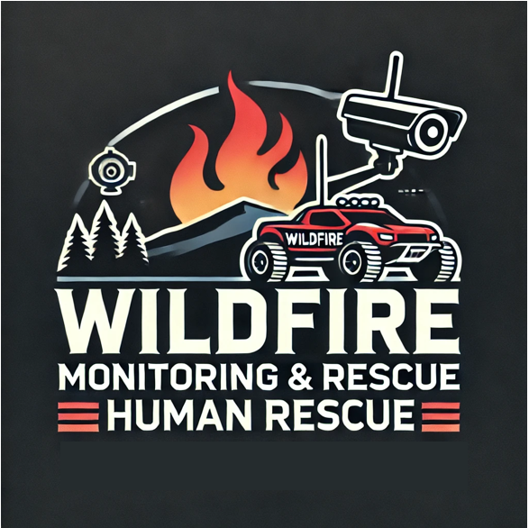

<h1 align="center">🔥산불 감시 및 인명 구조를 위한 객체 인식 프로젝트🔥</h1>

<p align="center">
  
</p>

# 1. 프로젝트 개요

#### 이 프로젝트는 YOLOv5 기반 객체 인식 기술을 활용한 산불 감시 및 인명 구조용 RC카 개발을 목표로 합니다. 라즈베리 파이와 카메라를 탑재한 RC 카는 실시간으로 영상을 전송하며, 인간이나 화염 감지 시 즉각적으로 경고 메시지와 이미지를 지정된 수신자에게 전송합니다.
---

## 🛠 사용 기술 및 도구

| 항목            | 내용                                           |
|-----------------|------------------------------------------------|
| **플랫폼**      | Raspberry Pi 3, Raspberry Pi 4                |
| **프로그래밍**  | Python                                         |
| **라이브러리**  | OpenCV, YOLOv5, MJPG-Streamer, Torch, Requests |
| **하드웨어**    | RC 카, 메카넘 휠, Pi 카메라                    |
| **메시징**      | 네이버 클라우드 메시징 서비스                  |
| **운영 체제**   | Raspbian (64-bit)                              |


## 주요 기능

- **원격 순찰**: RC 카는 원격으로 지정된 구역을 순찰하며, 실시간 비디오를 스트리밍합니다.
- **객체 인식**: 시스템은 특정 객체(인간, 화염)를 인식하여 경고를 전송합니다.
- **경고 시스템**: 객체가 감지되면 SMS 및 이메일을 통해 경고를 전송합니다.
- **전방향 이동**: RC 카는 메카넘 휠을 장착하여 모든 방향으로 이동할 수 있어 험난한 지형에서도 기동성을 발휘합니다.


## 팀원 및 역할 담당

### **팀 이름**: 김남재와 아이들

| 이름       | 역할                                                        |
|------------|-------------------------------------------------------------|
| **[팀장]김남재** | RC 카 제어 시스템 개발 총괄 및 하드웨어(RC카) 설계               |
| **이성수** | 객체 인식 시스템 개발 지원              |
| **신윤호** | RC 카 제어 시스템 개발 지원 |
| **황영진** | 객체 인식 시스템 개발, 모델링, 데이터 수집 및 데이터 셋 구성     |
| **김주완** | 객체 인식 시스템 개발, 모델링, 데이터 수집, 이메일 전송 및 문자 알림 기능 구현, 데이터 셋 구성 |
| **나영우** | 객체 인식 시스템 개발 지원   |


## 시연 영상

프로젝트의 시연 영상을 확인해보세요:

[](https://youtube.com/shorts/qTjb0LFu7_o)

---

## 시스템 아키텍쳐

이 프로젝트는 두 개의 주요 컴포넌트로 구성됩니다:

1. **객체 인식 시스템**: 
   - **소프트웨어**: YOLOv5를 활용하여 실시간 객체 인식을 수행합니다.
   - **하드웨어**: 라즈베리 파이가 RC 카를 제어하고 카메라로부터 비디오 피드를 처리합니다.
   - **기능**: 객체를 감지하고 경고를 전송하며, 감지 기록을 저장합니다.

2. **RC 카 제어 시스템**:
   - **소프트웨어**: Python 스크립트를 사용하여 감지된 객체에 따라 카의 움직임을 제어합니다.
   - **하드웨어**: 메카넘 휠을 통해 RC 카가 모든 방향으로 이동할 수 있습니다.

---

# 2. 프로젝트 보고서 요약
## [**🔗 보고서 바로가기**](https://neighborly-goal-bcc.notion.site/YOLOv5-RC-11c6ccbcf63f4a8987c79541a7afbe07)

---
# 3. 설치 & 설정

## 1. 객체 인식 설정
- **YOLOv5 설치**:
    ```bash
    git clone https://github.com/ultralytics/yolov5
    cd yolov5
    pip install -r requirements.txt
    ```
- **라즈베리 파이 설정**:
    - 필요한 종속성을 설치합니다.
    - Pi 카메라를 설정하고 `sudo raspi-config`를 통해 활성화합니다.
    - MJPG-Streamer를 설치하여 비디오 스트리밍을 설정합니다.

## 2. RC카 제어
- **GPIO 설정**:
    - 모터 제어를 위한 GPIO 핀을 구성합니다.
    - Python `RPi.GPIO` 라이브러리를 사용하여 카의 움직임을 제어합니다.

## 3. 경고 시스템 구성
- **메시징 서비스**:
    - 네이버 클라우드 메시징 서비스에 등록하고 설정합니다.
    - API 키와 전화번호를 Python 스크립트에 구성합니다.

---

# 4. 사용 방법

1. **객체 인식 시작**:
    ```bash
    python detect.py --weights yolov5s.pt --source 0  # 웹캠 사용 시
    ```
2. **RC카 제어**:
    - 컨트롤러나 스크립트를 사용하여 카의 이동 명령을 전송합니다.
3. **경고 수신**:
    - 객체가 감지되면 등록된 이메일로 현장 사진이 전송되며, SMS로 경고 문자가 전송됩니다.

---

# 5. 문제 및 해결

### 상황
  - #### 문제 발생:
     메시지 전송을 위해 원래 카카오톡 API를 활용하려 했으나, 권한 문제로 인해 사용할 수 없었습니다.

      
  - #### 원인 파악:
     카카오톡 메세지 API 사용을 위해서는 카카오톡에 API 권한 요청을 해야합니다. 이 과정에서 사업자 등록증 등의 제출이 요구되며, 우리처럼 개인이나 작은 프로젝트의 경우 승인 받기 어렵기 때문에 사용이 불가했습니다.

      
  - #### 문제 해결:
     권한 문제가 없는 네이버 클라우드 메시지 서비스를 사용하여 메시지 전송 기능을 구현했습니다. 이로써 필요한 경고 메시지를 원활하게 전송할 수 있게 되었습니다.

  - 네이버 클라우드 메시지 서비스 api 활용
   ```
python
access_key_id = "YOUR_KEY_ID" #sms메시지를 전송하기 위해 가입한 api서비스의 액세스 키 값 정의(서비스:네이버 클라우드 메시징 서비스)
api_secret_key = "YOUR_SECRET_KEY" #사용자 구분용 시크릿 키
url = "YOUR_URL" #메시징서비스 url
phone_number = "YOUR_PHONENUMBER" #메시지를 받는 전화번호
message = "물체가 감지되었습니다. 화면을 확인해주세요." #문자 내용

# HMAC-SHA256 서명을 생성하는 함수
def make_signature():
    timestamp = int(time.time() * 1000) # 현재 시간을 Unix 타임스탬프로 가져옴
    timestamp = str(timestamp) # 타임 스탬프를 문자열로 변환

    secret_key = bytearray(api_secret_key, 'UTF-8') # 시크릿 키를 바이트 배열로 변환
    method = "POST" # HTTP 메서드를 "POST"로 설정
    uri = f"YOUR_URL" # SMS 전송 API의 URI 설정
    message = f"{method} {uri}\n{timestamp}\n{access_key_id}" # 서명할 문자열 생성
    message = message.encode('UTF-8') # 메시지를 UTF-8로 인코딩

    signature = hmac.new(secret_key, message, digestmod=hashlib.sha256).digest() # HMAC-SHA256 서명 생성
    signature = base64.b64encode(signature) # 서명을 base64로 인코딩
    return signature.decode('UTF-8'), timestamp # 서명을 디코딩하여 반환, 타임스탬프와 함께 반환

# SMS 메시지 전송 함수
def send_sms(phone_number, message):
    url = "YOUR_URL"
    # SMS 전송 API의 엔드포인트 URL
    signature, timestamp = make_signature()
    # make_signature 함수를 호출하여 서명과 타임스탬프 생성
    headers = { # API 호출에 필요한 HTTP 헤더 설정
        "Content-Type": "application/json; charset=utf-8",
        "x-ncp-apigw-timestamp": timestamp,
        "x-ncp-iam-access-key": access_key_id,
        "x-ncp-apigw-signature-v2": signature,
    }
    data = { # JSON 형식의 메시지 데이터 설정
        "type": "SMS",
        "contentType": "COMM",
        "from": "PHONENUMBER",
        "content": message,
        "subject": "SENS",
        "messages": [
            {
                "to": phone_number,
            }
        ]
    }
    response = requests.post(url, headers=headers, data=json.dumps(data))
    # 설정된 헤더와 데이터를 사용하여 POST 요청 전송
    print(response.content) # API 호출의 응답 내용 출력
  ```

---

# 6. 프로젝트 완료 리뷰
- ### 아쉬웠던 점:
  #### 1. 파이썬과 라즈베리 파이 지식이 부족해 활용에 많은 어려움을 겪었습니다.

   
    
- ### 잘한 점:
  #### 1. 밤 늦게까지 학과 강의실에 남아 팀원들과 개발을 진행하였고 틈틈히 부족한 부분에 대해 더 공부를 하였습니다.
  #### 2. 팀원들과의 원활한 커뮤니케이션 및 협력을 통해 프로젝트를 성공적으로 완성 시킬 수 있었습니다
   
    
- ### 배운 점:
  #### 1. 이번 프로젝트를 통해 라즈베리 파이와 같은 임베디드 시스템을 제어하는 방법을 학습하고, GPIO 핀을 활용한 모터 제어 등 하드웨어적인 부분에 대한 이해도가 높아졌습니다. 이는 앞으로 IoT 분야에서 더 많은 프로젝트를 진행할 수 있는 기반이 되었습니다.
  #### 2. YOLOv5를 사용하여 실시간으로 객체를 인식하고 경고를 전송하는 시스템을 구현함으로써, 딥러닝과 객체 인식 기술의 실제 적용 방법에 대한 깊은 이해를 쌓을 수 있었습니다. 또한, 데이터셋 구축과 모델 학습 과정에서 데이터의 중요성을 체감할 수 있었습니다.
